# Farm Management System
Farm Management System using MySQL, Php and Bootstrap

## Prerequisites
1. Install XAMPP web server
2. Any Editor (Preferably VS Code or Sublime Text)
3. Any web browser with latest version

## Languages and Technologies used
1. HTML5/CSS3
2. JavaScript (to create dynamically updating content)
3. Bootstrap (An HTML, CSS, and JS library)
4. XAMPP (A web server by Apache Friends)
5. Php
6. MySQL (An RDBMS that uses SQL)
7. TCPDF (to generate PDFs)

## Steps to run the project in your machine
1. Download and install XAMPP in your machine
2. Clone or download the repository
3. Extract all the files and move it to the 'htdocs' folder of your XAMPP directory.
4. Start the Apache and Mysql in your XAMPP control panel.
5. Open your web browser and type 'localhost/phpmyadmin'
6. In phpmyadmin page, create a new database from the left panel and name it as 'fms'
7. Import the file 'fms.sql' inside your newly created database and click ok.
8. Open a new tab and type 'localhost/foldername' in the url of your browser
9. Hurray! That's it!
    
### SOFTWARES USED
  - XAMPP was installed on the Ubuntu 19.04 machine and APACHE2 Server and MySQL were initialized. And, files were built inside opt/lampp/htdocs/fms
  - Sublime Text 3.2 was used as a text editor.
  - Google Chrome Version 77.0.3865.90 was used to run the project (localhost/fms was used as the url).
  

### Starting Apache And MySQL in XAMPP:
  The XAMPP Control Panel allows you to manually start and stop Apache and MySQL. To start Apache or MySQL manually, click the ‘Start’ button under ‘Actions’.

## GETTING INTO THE PROJECT:
Farm Management System in php and mysql. This system has a ‘Home’ page from where the user, employee & administrator can login into their accounts by toggling the tabs accordingly. Fig 1.1 shows the ‘Home’ page of our project.

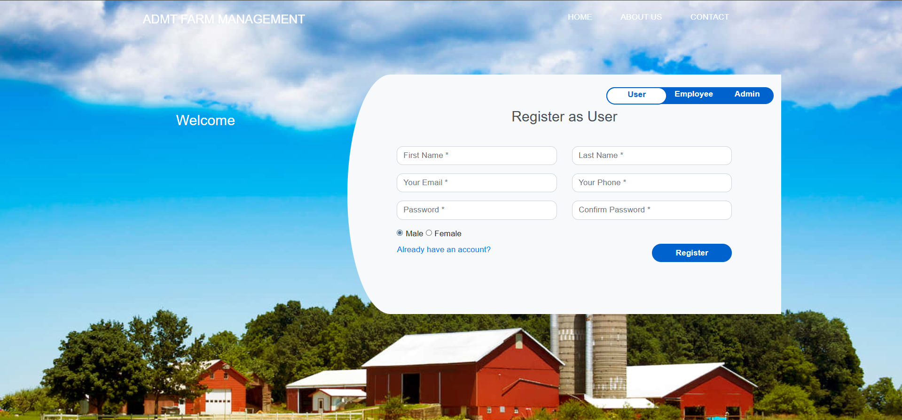

'About Us' page (Fig 1.2)  allows us to get some more information about the quality and the services of the hospital.

‘Contact’ page allows users to provide feedback or queries about the services of the hospital. Fig 1.3 shows the ‘Contact’ page.

The ‘Home’ page consists of 3 modules:
1. User Module
2. Employee Module
3. Admin Module

### User Module:

  &nbsp; &nbsp; &nbsp; This module allows Users to create their account and to see details about plant, medicines & method.
  The registration page(in the home page itself) asks users to enter their First Name, Last Name, Email ID, Contact Number, Password and radio buttons to select their gender.(Fig 1.4).
  
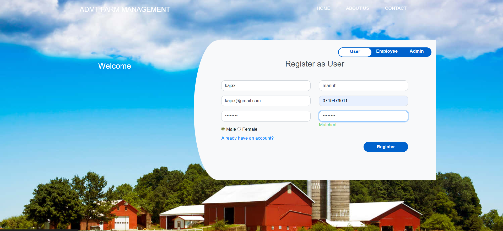

Once the user has created his/her own account after clicking the ‘Register’ button, then he will be redirected to his/her Dashboard(Fig 1.5).
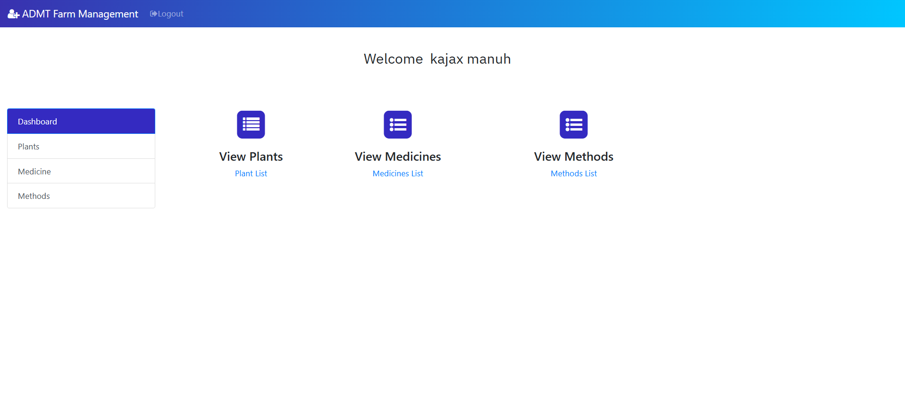

The Dashboard page allows users to perform three operations:

**1. View users’ Plant details:**

  &nbsp; &nbsp; &nbsp; Here, the user can see the plant details.(See Fig 1.6).

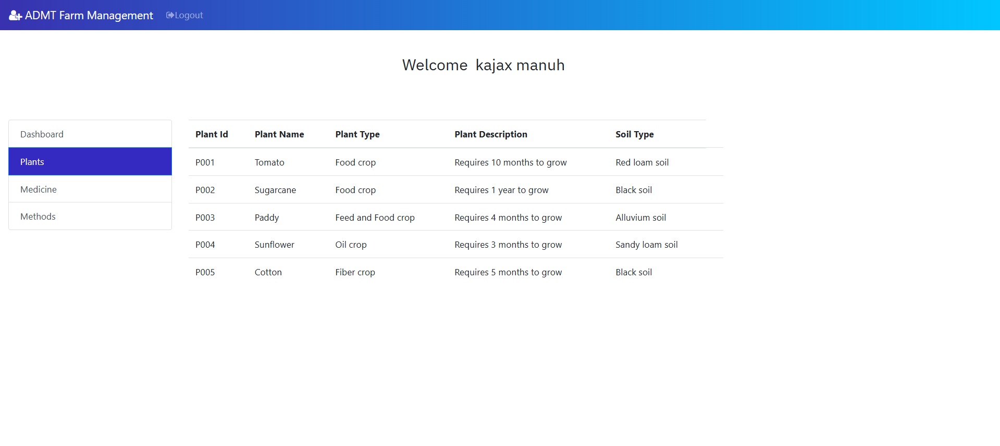

**2. View users’ Medicine details:**

  &nbsp; &nbsp; &nbsp; Here, the user can see the medicine details.(See Fig 1.7).
  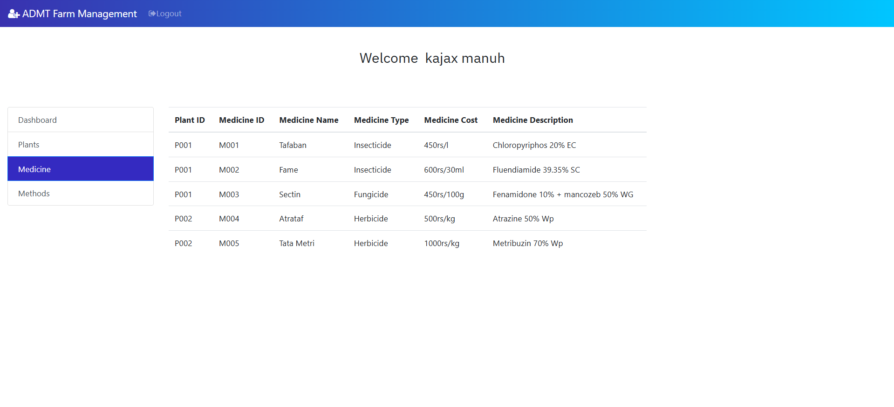

  
**3. View users’ Methods details:**

  &nbsp; &nbsp; &nbsp; Here, the user can see the method details.(See Fig 1.8).
  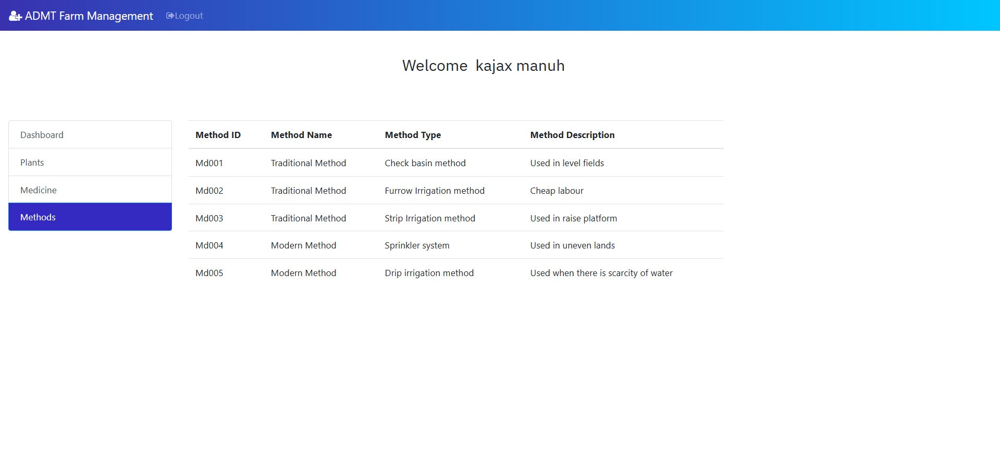

Once the user has logged out of his account, if he wants to go into his account again, he can login his account, instead of register his account again. Fig 1.9 shows the login page.
Clicking on ‘Login’ button will redirect the user to his dashboard page which we have seen earlier (Fig 1.5)

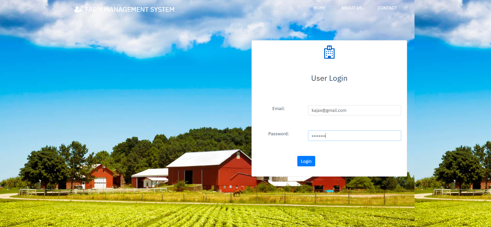

This is how the user module works. On the whole, this module allows users to register their account or login their account(if he/she has one) and to view plant , medicines & methods details.

### Employee Module:

  &nbsp; &nbsp; &nbsp; The employee can login into their account which can be done by toggling the tab from ‘User’ to ‘Employee’. Fig 1.10 shows the login form for a employee. Registration of a employee account can be done only by admin. We will discuss more about this in Admin Module.
  
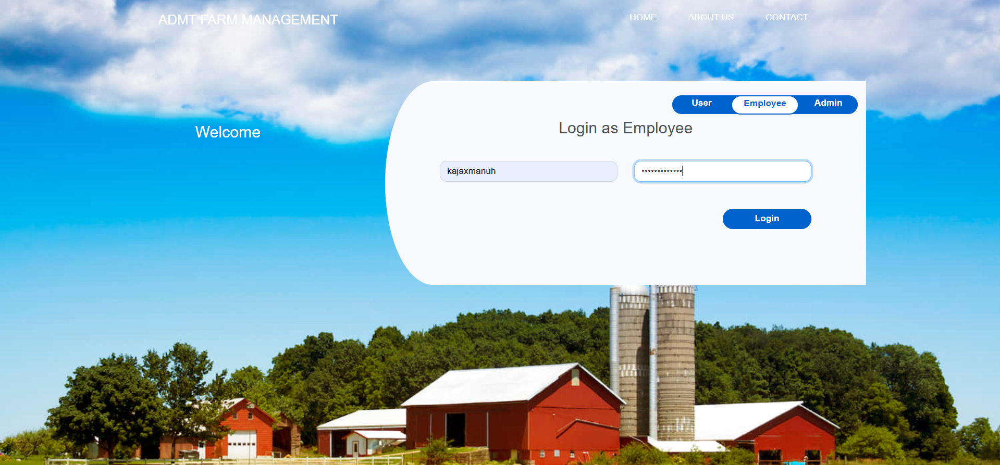

Once the employee clicking the ‘Login’ button, they will be redirected to their own dashboard which is shown in Fig 1.11

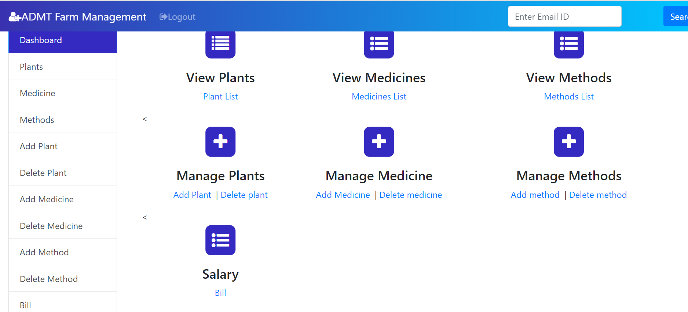

In this page, employee can able to add details about plant, medicines and methods and to can view those details. 
**1. Add Plants:**

  &nbsp; &nbsp; &nbsp; Employee alone can add a new plant. This form asks plant id, name, soil type.(See Fig 1.12)
  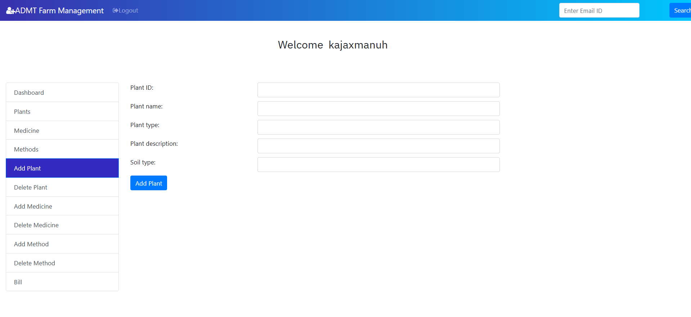

**2. Add Medicines:**

  &nbsp; &nbsp; &nbsp; Employee can add a new medicine. This form asks medicine id, name, type and cost.(See Fig 1.13)
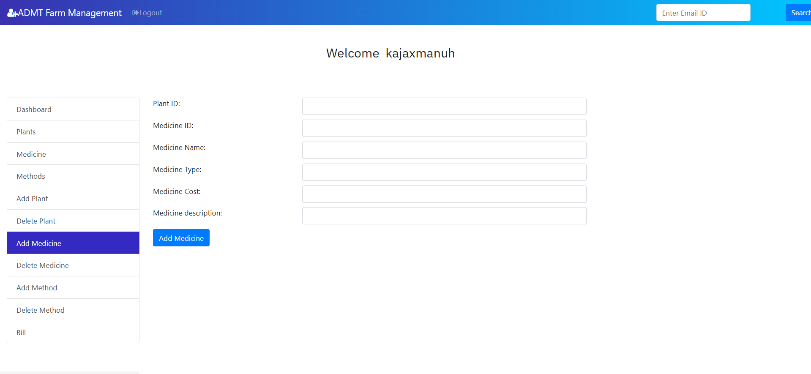

**3. Add Method:**

  &nbsp; &nbsp; &nbsp; Employee alone can add a new Method. This form asks method id, name, type.(See Fig 1.14)
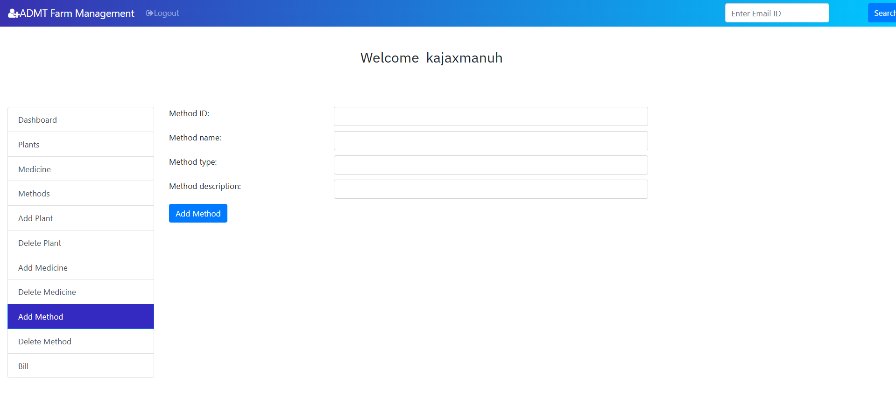

&nbsp; &nbsp; &nbsp; Once everything is done, the employee can logout of their account. Thus, in general, a employee can login into his/her account, add details about plants, medicines and methods and to view them. This is all about Employee Module.

### Admin Module:
   
   &nbsp; &nbsp; &nbsp; This module is the heart of our project where an admin can see the list of all patients.Employee, Pants, Medicines, Methods and the feedback/queries received from the ‘Contact’ page. Also admin can add employee too. 
  &nbsp; &nbsp; &nbsp; Login into admin account can be done by toggling into admin tab of the Home page. Fig 1.15 shows the login page for admin.
  &nbsp; &nbsp; &nbsp; `username`: admin, `password`: admin123

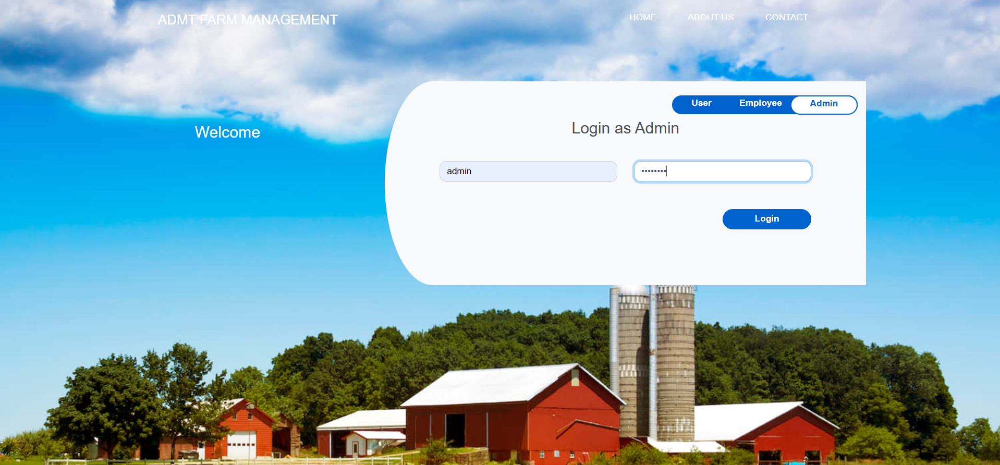

On clicking the ‘Login’ button, the admin will be redirected to his/her dashboard as shown in 
Fig 1.16.

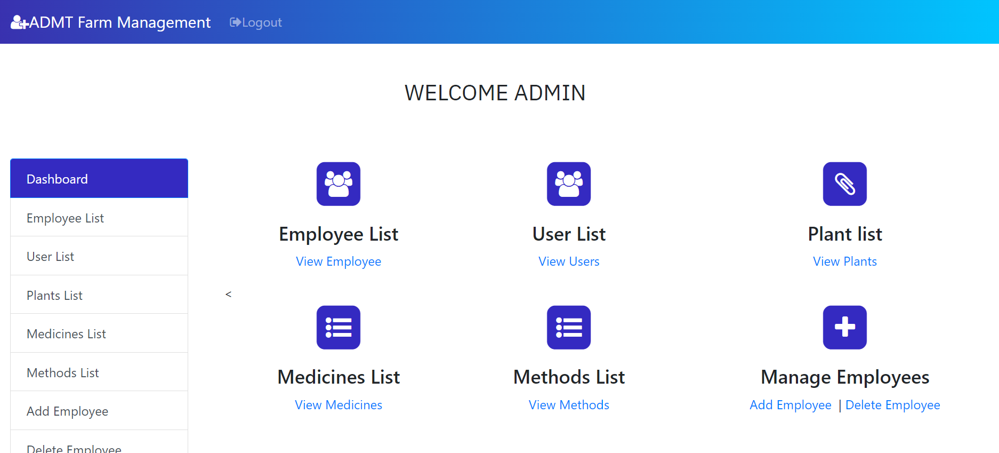

This module allows admin to perform five major operations:

**1. View the list of all users registered:**

  &nbsp; &nbsp; &nbsp; Admin can able to view all the users registered. This includes the users’ First Name, Last Name, Email ID, Contact Number and Password. (See Fig 1.17).As like in employee module, admin can also search for a user by their contact number in the search box.
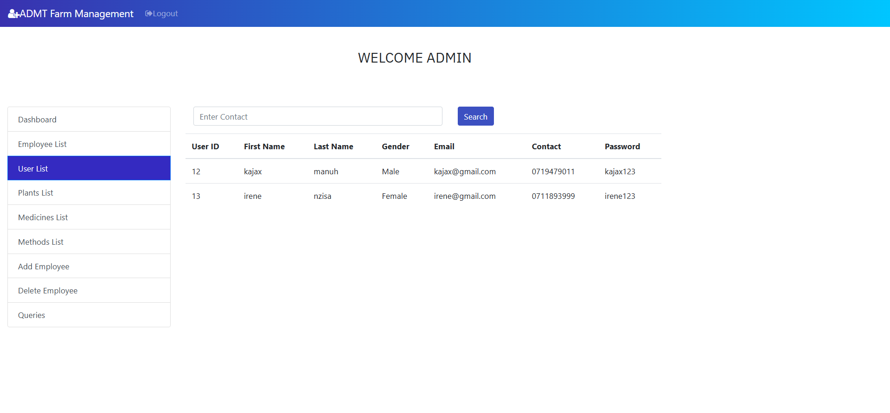

**2. View the list of all employees registered:**

  &nbsp; &nbsp; &nbsp; Details of the doctors can also be viewed by the admin. This details include the Name of the employee, Password, Email and Consultancy fees, shown in Fig 1.18. Searching for a employee can be done by using the employee’s Email ID in the search box.
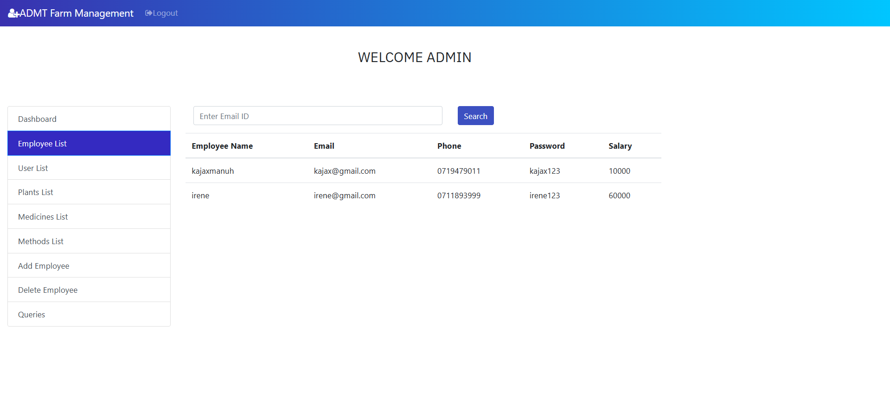

**3. View the Plant lists:**

  &nbsp; &nbsp; &nbsp; Admin can also able to see the entire details of the plants. This includes the Plant id, name, soil type. (See Fig 1.19). 

  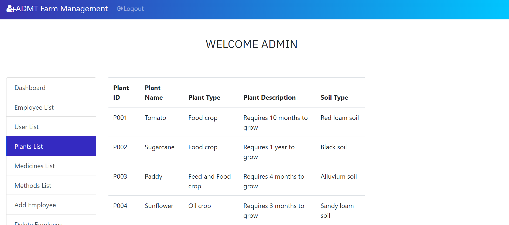
  
**4. View the Medicine lists:**

  &nbsp; &nbsp; &nbsp; Admin can also able to see the entire details of the medicines(See Fig 1.20). 
  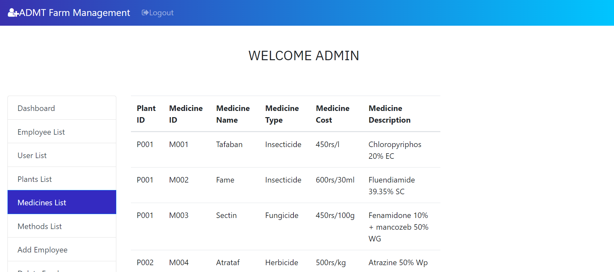

**5. View the Method lists:**

  &nbsp; &nbsp; &nbsp; Admin can also able to see the entire details of the methods(See Fig 1.21). 
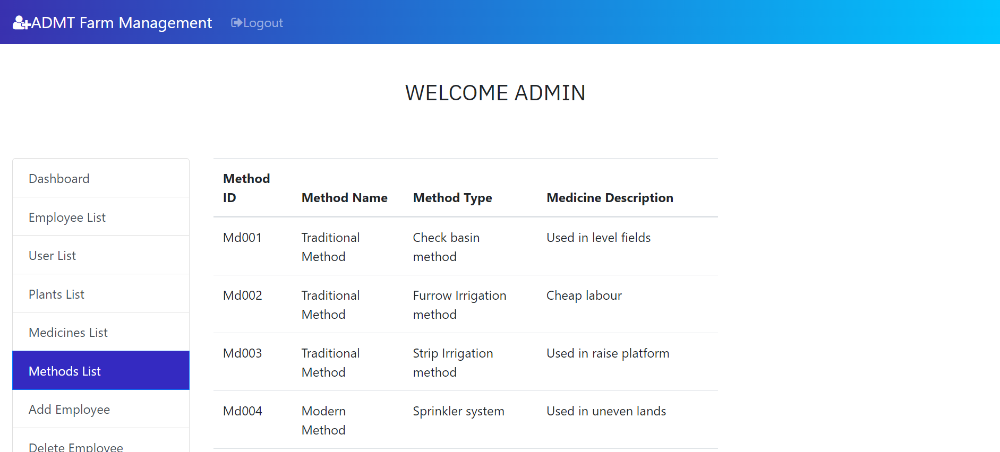

**6. Add Employee:**

  &nbsp; &nbsp; &nbsp; Admin alone can add a new employee since anyone can register as a employee if we put this section on the home page. This form asks employee’s Name, Email ID, Password and his/her salary.(See Fig 1.22)
  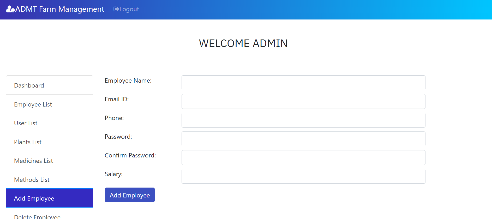
  
**7. Remove Employee by Admin

&nbsp; &nbsp; &nbsp; Admin can also delete the employees from the system. This let admin to have more control over the system.(See Fig 1.23)
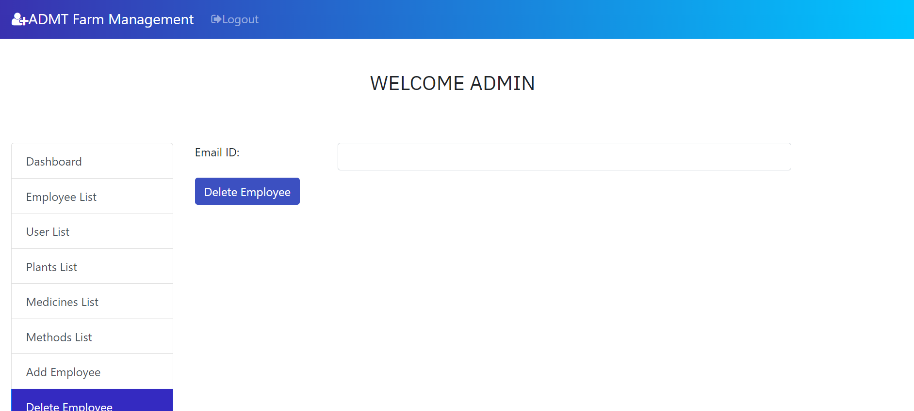

**8. View User’s feedback/Queries:**

  &nbsp; &nbsp; &nbsp; Admin is allowed to view the feedback/Query that has been given by the user in the ‘Contact’ page (Refer Fig 1.3). This includes User’s Name, Email Id, Contact Number and the message(Feedback/ Query) as shown in the Fig 1.24.
  
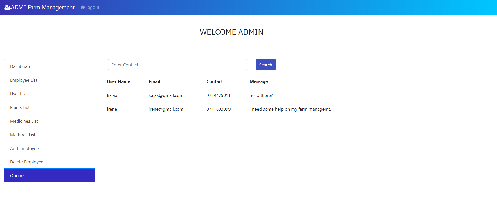

  &nbsp; &nbsp; &nbsp; Taking everything into consideration, admin can able to view the details of users and employees, plant, medicines, method details, Feedback by the user and can add a new employee. Once everything is done, the admin can logout from his account.

